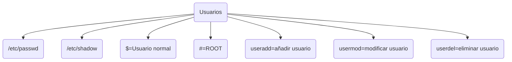
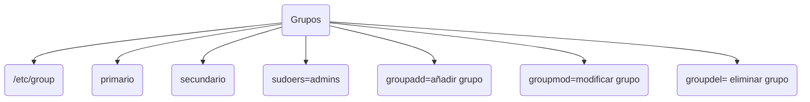
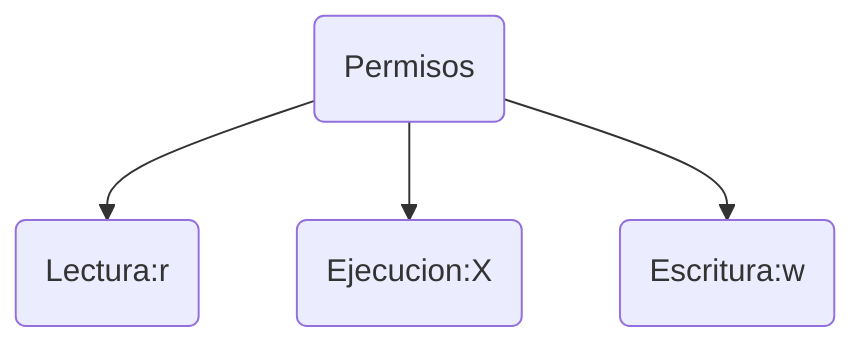
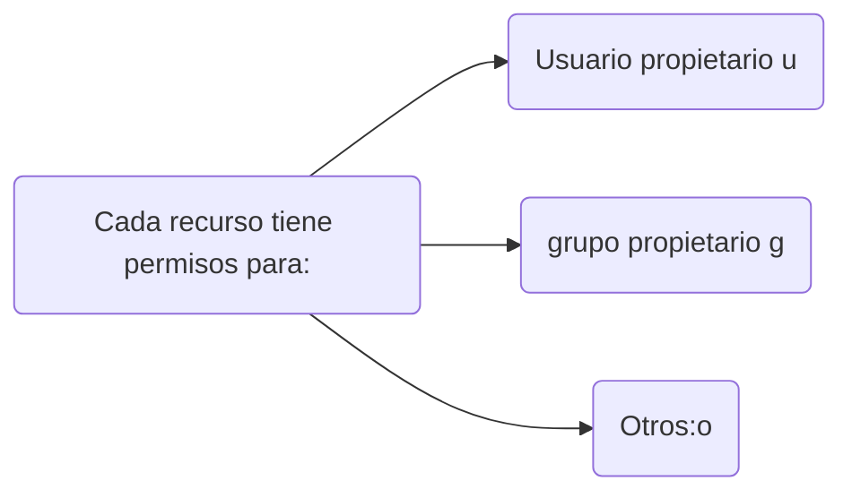

# USUARIOS Y PERMISOS EN LINUX
* usuarios y grupos:

```mermaid
flowchart TD
    U(Usuarios)
    RU1(/etc/passwd)
    RU2(/etc/shadow)
    SIMU($=Usuario normal)
    SIMU2(#=ROOT)
    COMU1(useradd=añadir usuario)
    COMU2(usermod=modificar usuario)
    COMU3(userdel=eliminar usuario)

    U-->RU1
    U-->RU2
    U-->SIMU
    U-->SIMU2
    U-->COMU1
    U-->COMU2
    U-->COMU3
```

```mermaid
flowchart TD
    G(Grupos)
    RG(/etc/group)
    TIPG1(primario)
    TIPG2(secundario)
    ADMG(sudoers=admins)
    COMG1(groupadd=añadir grupo)
    COMG2(groupmod=modificar grupo)
    COMG3(groupdel= eliminar grupo)

    G-->RG
    G-->TIPG1
    G-->TIPG2
    G-->ADMG
    G-->COMG1
    G-->COMG2
    G-->COMG3
```
# Permisos:

```mermaid
    flowchart TD
    P(Permisos)
    L(Lectura:r)
    ES(Escritura:w)
    E(Ejecucion:X)
    P-->L
    P-->E
    P-->ES
```

```mermaid
    flowchart LR
    T(Cada recurso tiene permisos para:)
    u(Usuario propietario  u)
    g(grupo propietario g)
    o(Otros:o)
    T-->u
    T-->g
    T-->o

```

